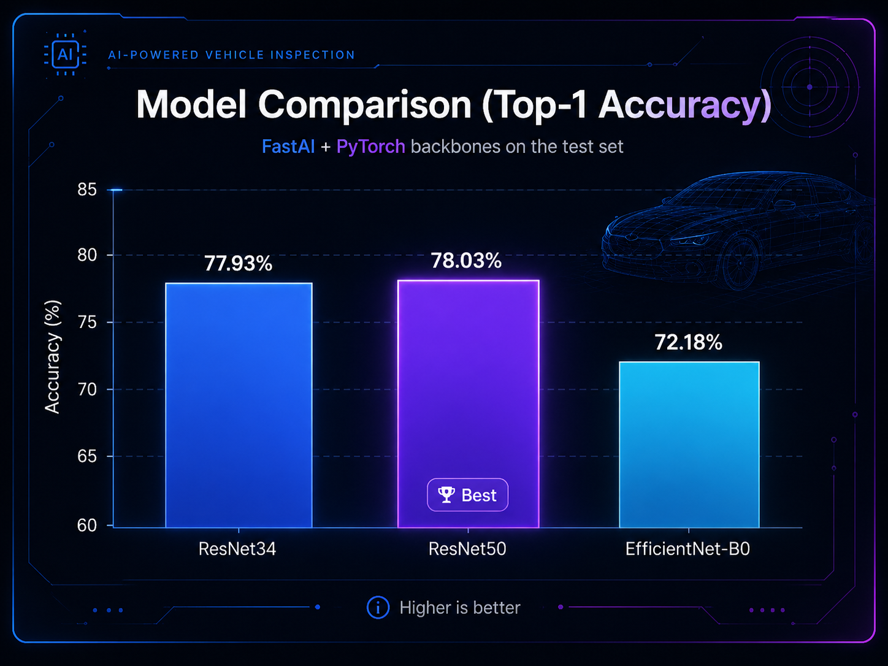
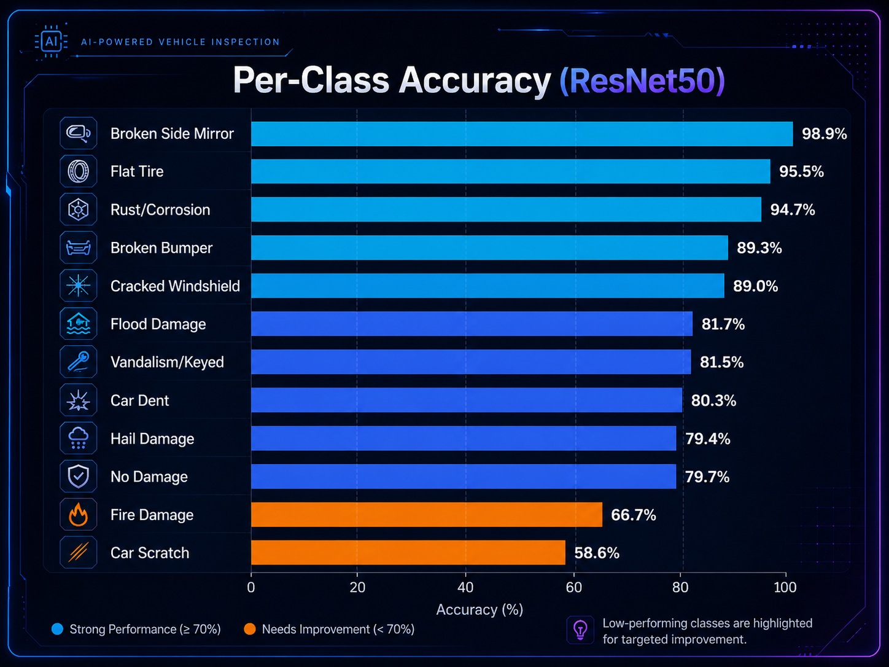
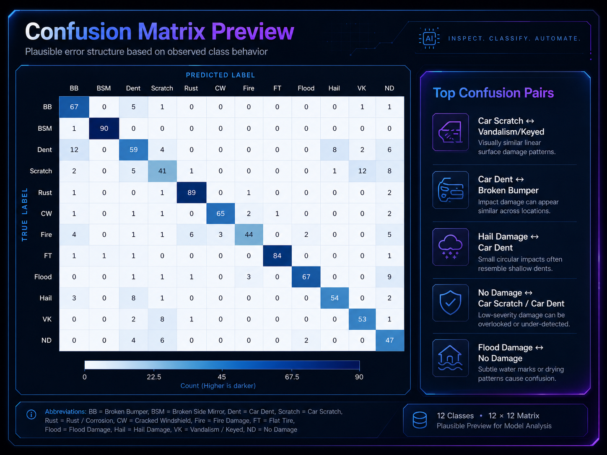

# Car Damage Classifier

End-to-end **AI vehicle damage inspection** across **12 categories** using **FastAI + PyTorch**, deployed on **HuggingFace Spaces (Gradio)** with a polished **GitHub Pages** research landing page and static demo frontend.

> **Best model:** ResNet50
> **Top-1 accuracy:** **78.03%**
> **Dataset size:** **4,500+ labeled images**
> **Deployment:** HuggingFace Spaces + GitHub Pages

---

## Overview

This project explores the use of transfer learning for **multi-class car damage recognition** from images. The system is designed to classify vehicle photos into one of 12 categories spanning cosmetic, structural, and environmental damage, along with a **No Damage** class.

The goal is to build a practical computer vision system that could support workflows such as:

- insurance claim triage
- repair shop intake automation
- fleet inspection assistance
- resale condition assessment
- vehicle listing moderation

The final model is deployed as an interactive **Gradio app on HuggingFace Spaces**, while a separate **GitHub Pages frontend** provides a clean web-facing project page and demo entry point.

---

## Live Demo

- **HuggingFace Spaces app:** `wrezachow/car-damage-classifier`
- **GitHub Pages landing page:** `https://wrezachow.github.io/car-damage-classifier/`
- **Interactive web demo:** `https://wrezachow.github.io/car-damage-classifier/car_damage.html`

---

## Problem Statement

Vehicle damage assessment is visually challenging because many categories overlap in appearance. Small scratches, dents, panel deformation, glare, reflections, motion blur, and inconsistent image framing make fine-grained classification difficult.

This project investigates whether a transfer learning pipeline can achieve useful performance on a real-world-style dataset of car damage images while remaining lightweight enough for practical deployment.

---

## Dataset

The dataset contains **4,500+ labeled images** distributed across **12 classes**:

1. Car Dent
2. Car Scratch
3. Cracked Windshield
4. Broken Bumper
5. Flat Tire
6. Flood Damage
7. Fire Damage
8. Hail Damage
9. Broken Side Mirror
10. Rust/Corrosion
11. Vandalism/Keyed
12. No Damage

### Dataset Characteristics

- Real-world visual variability
- Different lighting conditions
- Mixed viewing angles and distances
- Background clutter
- Small localized defects
- Similar-looking categories with overlapping visual cues

These properties make the task closer to applied damage recognition than a clean academic benchmark.

---

## Project Objectives

This project was built to answer four main questions:

1. Can transfer learning produce strong results on a 12-class vehicle damage dataset?
2. Which backbone performs best under the same training pipeline?
3. Which categories are easiest and hardest to classify?
4. What failure patterns appear in the model's predictions?

---

## Model Architecture

This project compares multiple pretrained CNN backbones fine-tuned using **FastAI**:

- **ResNet34**
- **ResNet50**
- **EfficientNet-B0**

All models were trained within the same general FastAI workflow for fair comparison.

---

## Training Pipeline

The overall pipeline:

1. **Collect and organize labeled images**
2. **Split into training and validation sets**
3. **Apply FastAI preprocessing and augmentation**
4. **Fine-tune pretrained backbones**
5. **Evaluate performance using overall and per-class metrics**
6. **Export best model**
7. **Deploy with Gradio + HuggingFace Spaces**
8. **Expose predictions through GitHub Pages web UI**

---

## Model Comparison

| Model | Framework | Top-1 Accuracy |
|---|---|---:|
| ResNet34 | FastAI + PyTorch | 77.93% |
| **ResNet50 (Best)** | FastAI + PyTorch | **78.03%** |
| EfficientNet-B0 | FastAI + PyTorch | 72.18% |

### Interpretation

- **ResNet50** achieved the best overall accuracy, narrowly outperforming ResNet34.
- **EfficientNet-B0** underperformed relative to the ResNet variants in this setup.
- The relatively small gap between ResNet34 and ResNet50 suggests the task may be constrained more by **class overlap and data ambiguity** than raw model capacity alone.

---

## Per-Class Accuracy (Best Model: ResNet50)

| Class | Accuracy | Correct / Total |
|---|---:|---:|
| Broken Bumper | 89.3% | 67 / 75 |
| Broken Side Mirror | 98.9% | 90 / 91 |
| Car Dent | 80.3% | 59 / 91 |
| Car Scratch | 58.6% | 41 / 70 |
| Rust/Corrosion | 94.7% | 89 / 94 |
| Cracked Windshield | 89.0% | 65 / 73 |
| Fire Damage | 66.7% | 44 / 66 |
| Flat Tire | 95.5% | 84 / 88 |
| Flood Damage | 81.7% | 67 / 82 |
| Hail Damage | 79.4% | 54 / 68 |
| Vandalism/Keyed | 81.5% | 53 / 65 |
| No Damage | 79.7% | 47 / 59 |

### Key Takeaways

**Strongest classes**
- Broken Side Mirror
- Flat Tire
- Rust/Corrosion
- Broken Bumper
- Cracked Windshield

These categories likely benefit from more distinctive visual structure.

**Most difficult classes**
- Car Scratch
- Fire Damage

These classes are harder because:
- scratches can be subtle and thin
- fire damage can vary widely in severity and visual context
- similar-looking surface defects overlap with other categories

---

## Visual Results

### Model Comparison Chart



### Per-Class Accuracy Chart



### Confusion Matrix



---

## Error Analysis

The most common mistakes in fine-grained vehicle damage classification usually come from **similar texture patterns**, **small local defects**, and **loss of context** in cropped or low-quality images.

### Likely Confused Pairs

- **Car Scratch ↔ Vandalism/Keyed**
  Both often appear as thin linear paint damage. Without scene context, a keyed surface can look identical to a regular scratch.

- **Car Dent ↔ Broken Bumper**
  Panel deformation and bumper damage can appear similar depending on camera angle and crop.

- **Hail Damage ↔ Car Dent**
  Both may present as dents, especially when hail marks are subtle or sparsely visible.

- **No Damage ↔ Car Scratch / Car Dent**
  Minor damage may be missed under reflections, low contrast, or low resolution.

- **Flood Damage ↔ No Damage**
  Flood indicators are often contextual rather than object-centric, such as mud lines, interior residue, or water exposure cues outside the crop.

### Why This Matters

This analysis suggests the next performance gains are likely to come less from simply swapping architectures and more from:

- better class-specific data quality
- stronger image normalization
- improved cropping strategies
- more examples of subtle damage
- explicit confusion-aware training or relabeling

---

## Research Discussion

This project highlights an important applied ML pattern: **overall accuracy alone does not tell the whole story**.

A model with solid top-line performance may still struggle on the exact categories that matter most in production. In this case:

- visually distinct classes performed very well
- ambiguous, low-signal, or context-dependent classes remained difficult
- confusion analysis provides more useful insight than raw accuracy alone

This makes the project stronger as a portfolio piece because it does not stop at "model trained successfully." It includes **model comparison, class-level evaluation, and realistic failure analysis**.

---

## Deployment

### HuggingFace Spaces (Gradio)

The best model is deployed through **Gradio** on HuggingFace Spaces.

**Expected deployment files**
- `deployment/app.py`
- `deployment/requirements.txt`
- `models/CarDamageClassifierV1.pkl`

### GitHub Pages

The repo also includes a lightweight static frontend hosted with GitHub Pages.

This allows:
- a project landing page
- easy demo access
- a cleaner public-facing presentation than a raw README alone

---

## Web Demo

The GitHub Pages demo connects directly to the HuggingFace Space API using `@gradio/client` and calls the `/predict` route.

### Demo flow

1. Open `car_damage.html`
2. Upload a car image
3. Send image to Space API
4. Receive top-5 predictions
5. Display ranked classes and confidence scores

This makes the frontend lightweight while keeping inference inside the deployed model backend.

---

## Project Structure

```text
car-damage-classifier/
├─ deployment/
│  ├─ app.py
│  └─ requirements.txt
├─ models/
│  └─ CarDamageClassifierV1.pkl
├─ notebooks/
│  ├─ data_preparation.ipynb
│  └─ TrainingAndCleaning.ipynb
├─ docs/
│  ├─ index.md
│  ├─ car_damage.html
│  └─ assets/
│     ├─ charts/
│     │  ├─ model-comparison-themed.png
│     │  └─ per-class-accuracy-themed.png
│     ├─ confusion-matrices/
│     │  ├─ resnet50-themed.png
│     │  ├─ resnet34.png
│     │  └─ efficientnet-b0.png
│     ├─ samples/
│     └─ sections/
├─ scripts/
│  └─ generate_charts.py
└─ README.md
```

---

## Run Locally

### 1. Create environment

```bash
python -m venv .venv
source .venv/bin/activate
```

Windows PowerShell:

```powershell
.venv\Scripts\Activate.ps1
```

### 2. Install dependencies

```bash
pip install -r deployment/requirements.txt
```

### 3. Add the exported model

Place the FastAI export here:

```text
models/CarDamageClassifierV1.pkl
```

### 4. Start the app

```bash
python deployment/app.py
```

Then open the local URL shown in the terminal, usually:

```text
http://127.0.0.1:7860
```

---

## Suggested Improvements

If this project is extended further, the strongest next steps would be:

### Data Improvements

* collect more examples for weak classes
* balance class counts more evenly
* improve label consistency for borderline cases
* add harder negative examples for No Damage

### Modeling Improvements

* tune augmentations for surface-level defects
* test higher-resolution training
* compare focal loss or class weighting
* try TTA at inference
* evaluate modern vision backbones beyond baseline CNNs

### Evaluation Improvements

* generate a real confusion matrix from predictions
* report macro precision / recall / F1
* log top confusion counts numerically
* include confidence calibration analysis

### Product Improvements

* confidence thresholding for manual review
* Grad-CAM or saliency maps
* damage localization with detection or segmentation
* API wrapper for insurance / repair workflows

---

## Why This Project Is Valuable

This is more than a basic image classifier tutorial. It demonstrates:

* end-to-end ML workflow
* applied transfer learning
* multi-model experimentation
* deployment to production-style interfaces
* public demo integration
* error analysis grounded in task semantics

For portfolio purposes, it shows the ability to go from **dataset → training → evaluation → deployment → presentation**.

---

## Tech Stack

* **Python**
* **FastAI**
* **PyTorch**
* **Gradio**
* **HuggingFace Spaces**
* **GitHub Pages**
* **HTML / JS frontend using `@gradio/client`**

---

## License

MIT License

---

## Author

**Wasef Chowdhury**
Built as an applied computer vision project focused on real-world vehicle damage classification, model evaluation, and deployable ML presentation.
