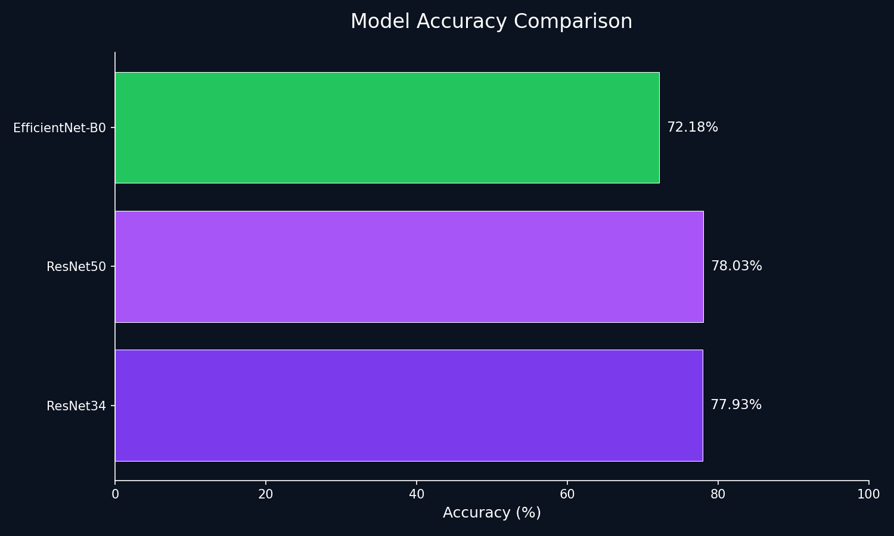
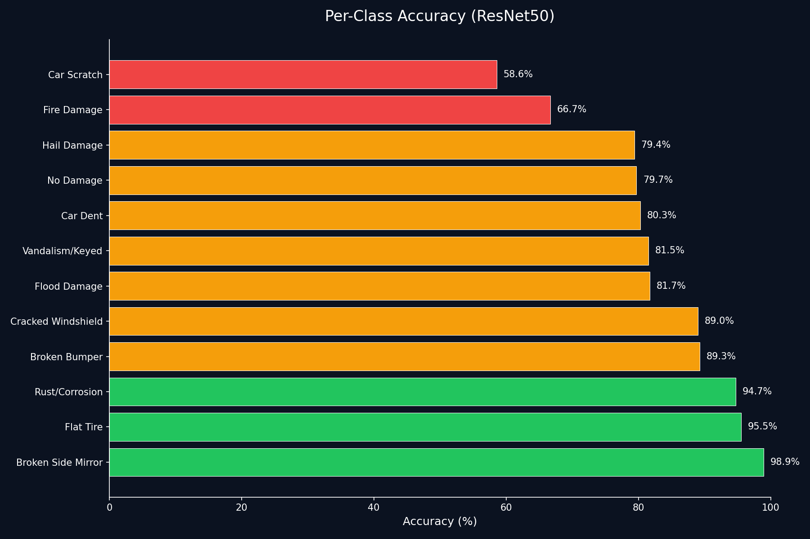
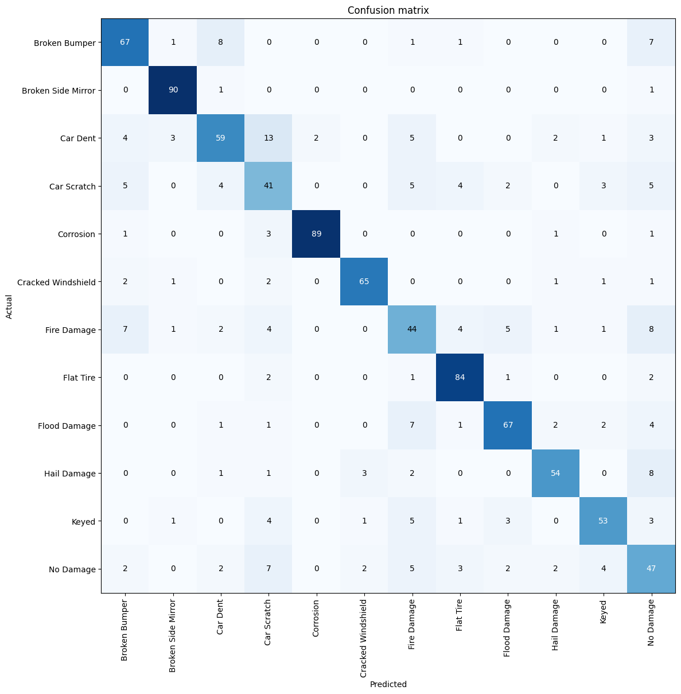

  

    
AI PROJECT

    <h1>Car Damage Classifier</h1>
    
End-to-end vehicle damage classification across 12 categories using FastAI + PyTorch

  

  

    

      
4,500+

      
Labeled Images

    

    

      
12

      
Categories

    

    

      
ResNet50

      
Best Model

    

    

      
78.03%

      
Top-1 Accuracy

    

    

      
FastAI

      
Framework

    

    

      
HF Spaces

      
Deployment

    

  

  

    <h2>Try the Demo</h2>
    

      <a href="car_damage.html" class="btn">Interactive Web Demo</a>
      <a href="https://huggingface.co/spaces/wrezachow/car-damage-classifier" class="btn" target="_blank">HuggingFace Space</a>
    

  

  

    <h2>Why This Project Matters</h2>
    

      <ul class="features">
        <li>Automates visual vehicle inspection for insurance claims, fleet management, and repair shops</li>
        <li>Reduces manual review time and provides consistent damage assessment</li>
        <li>Accelerates repair shop intake processing and vehicle condition documentation</li>
        <li>Enables faster, data-driven decision-making for insurance claim triage</li>
      </ul>
    

  

  

    <h2>Dataset Categories (12)</h2>
    

      

        <ol>
          <li>Car Dent</li>
          <li>Car Scratch</li>
          <li>Cracked Windshield</li>
          <li>Broken Bumper</li>
          <li>Flat Tire</li>
          <li>Flood Damage</li>
        </ol>
      

      

        <ol start="7">
          <li>Fire Damage</li>
          <li>Hail Damage</li>
          <li>Broken Side Mirror</li>
          <li>Rust/Corrosion</li>
          <li>Vandalism/Keyed</li>
          <li>No Damage</li>
        </ol>
      

    

  

  

    <h2>Results at a Glance</h2>

    <h3>Model Accuracy Comparison</h3>
    

      
    

    

      <h3>Key Findings</h3>
      <ul>
        <li><strong>ResNet50</strong> achieved the best overall accuracy at <strong>78.03%</strong></li>
        <li><strong>ResNet34</strong> performed nearly as well at <strong>77.93%</strong></li>
        <li><strong>EfficientNet-B0</strong> underperformed at <strong>72.18%</strong> in this setup</li>
        <li>The small gap between ResNet34 and ResNet50 suggests the task is constrained more by class overlap and data ambiguity than raw model capacity</li>
      </ul>
    

  

  

    <h2>Per-Class Accuracy (ResNet50)</h2>
    

      
    

    

      <h3>Performance Analysis</h3>
      
<strong>Strongest Classes (>90% accuracy):</strong>

      <ul>
        <li>Broken Side Mirror (98.9%)</li>
        <li>Flat Tire (95.5%)</li>
        <li>Rust/Corrosion (94.7%)</li>
      </ul>
      
<strong>Most Challenging Classes (<70% accuracy):</strong>

      <ul>
        <li>Car Scratch (58.6%) - subtle and thin, easily confused with vandalism</li>
        <li>Fire Damage (66.7%) - varies widely in severity and visual context</li>
      </ul>
    

  

  

    <h2>Confusion Matrix</h2>
    

      
    

  

  

    <h2>Top Confusion Pairs</h2>
    

      
The most common classification errors occur between visually similar damage types:

      <ul class="confusion-pairs">
        <li>Car Scratch ↔ Vandalism/Keyed</li>
        <li>Car Dent ↔ Broken Bumper</li>
        <li>Hail Damage ↔ Car Dent</li>
        <li>Fire Damage ↔ Flood Damage</li>
        <li>No Damage ↔ Car Scratch / Car Dent</li>
      </ul>
    

  

  

    <h2>Methodology & Pipeline</h2>
    

      

        <h4>1. Data Collection</h4>
        
4,500+ images from Bing & Google image search

      

      
→

      

        <h4>2. Preprocess & Augment</h4>
        
Resize, normalize, and apply FastAI augmentations

      

      
→

      

        <h4>3. Train</h4>
        
Fine-tune ResNet34, ResNet50, EfficientNet-B0

      

      
→

      

        <h4>4. Evaluate</h4>
        
Compare models, analyze confusion matrix

      

      
→

      

        <h4>5. Deploy</h4>
        
Export to Gradio on HuggingFace Spaces

      

    

  

  

    <h2>Project Structure</h2>
    <pre><code>car-damage-classifier/
├─ deployment/
│  ├─ app.py                 # Gradio app
│  └─ requirements.txt
├─ models/
│  └─ CarDamageClassifierV1.pkl
├─ notebooks/
│  ├─ data_preparation.ipynb
│  └─ TrainingAndCleaning.ipynb
├─ docs/
│  ├─ index.md
│  ├─ car_damage.html
│  └─ assets/
│     ├─ charts/
│     ├─ confusion-matrices/
│     └─ samples/
├─ scripts/
│  └─ generate_charts.py
└─ README.md</code></pre>
  

  

    <h2>Deployment</h2>
    

      

        <h3>HuggingFace Spaces</h3>
        
Interactive Gradio app for real-time predictions

        
<strong>Space:</strong> <code>wrezachow/car-damage-classifier</code>

        
<strong>Endpoint:</strong> <code>/predict</code>

      

      

        <h3>GitHub Pages</h3>
        
Static web demo using <code>@gradio/client</code>

        
<strong>Landing:</strong> Project documentation

        
<strong>Demo:</strong> <a href="car_damage.html">Interactive interface</a>

      

    

  

  

    <h2>Quick Start</h2>
    

      <h3>1. Clone the repository</h3>
      <pre><code>git clone https://github.com/wrezachow/car-damage-classifier.git
cd car-damage-classifier</code></pre>

      <h3>2. Create virtual environment</h3>
      <pre><code>python -m venv .venv</code></pre>

      <h3>3. Activate environment</h3>
      
<strong>Windows PowerShell:</strong>

      <pre><code>.venv\Scripts\Activate.ps1</code></pre>
      
<strong>macOS/Linux:</strong>

      <pre><code>source .venv/bin/activate</code></pre>

      <h3>4. Install dependencies</h3>
      <pre><code>pip install -r deployment/requirements.txt</code></pre>

      <h3>5. Run the app</h3>
      <pre><code>python deployment/app.py</code></pre>
      
Open <code>http://127.0.0.1:7860</code> in your browser

    

  

  

    <h2>Tech Stack</h2>
    

      

        <h3>Training & Model</h3>
        <ul>
          <li>Python 3.x</li>
          <li>FastAI</li>
          <li>PyTorch</li>
          <li>Jupyter Notebooks</li>
        </ul>
      

      

        <h3>Deployment</h3>
        <ul>
          <li>Gradio</li>
          <li>HuggingFace Spaces</li>
          <li>GitHub Pages</li>
          <li>@gradio/client</li>
        </ul>
      

    

  

  <footer>
    
<strong>Built with FastAI, PyTorch & Gradio</strong>

    
© 2025 Wasef Chowdhury | MIT License

    
<a href="https://github.com/wrezachow/car-damage-classifier" target="_blank">View on GitHub</a>

  </footer>

