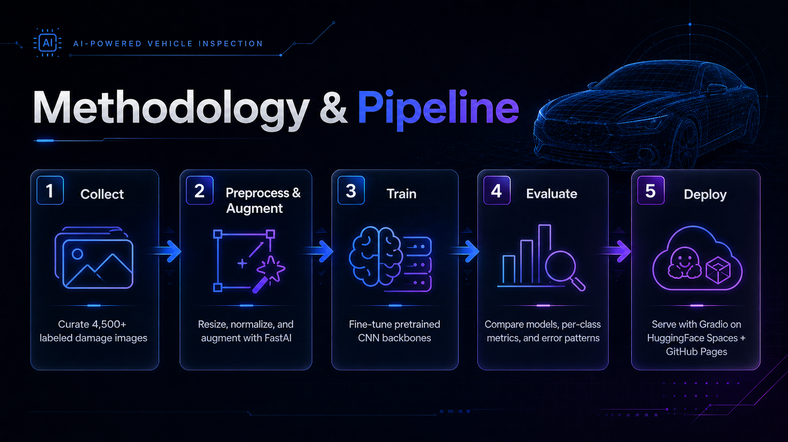

  <header class="cd-nav">
    

      <a class="brand" href="#top" aria-label="Car Damage Classifier home">
        CD
        
          CAR DAMAGE CLASSIFIER
          AI Vehicle Inspection
        
      </a>
      <nav class="nav-links" aria-label="Primary navigation">
        <a href="#why">Why</a>
        <a href="#dataset">Dataset</a>
        <a href="#results">Results</a>
        <a href="#methodology">Methodology</a>
        <a href="#deployment">Deployment</a>
        <a class="nav-cta" href="car_damage.html">Live Demo</a>
      </nav>
    

  </header>

  <main id="top">
    <section class="hero">
      

        

          
 Research-grade CV portfolio project

          <h1>AI vehicle damage inspection.</h1>
          

            A polished end-to-end computer vision system for classifying car damage across 12 real-world categories.
          

          

            The project trains and evaluates transfer-learning models with <strong>FastAI + PyTorch</strong>, selects
            <strong>ResNet50</strong> as the best backbone at <strong>78.03% top-1 accuracy</strong>, and deploys the
            model through <strong>HuggingFace Spaces</strong> with a GitHub Pages web demo.
          

          

            <a class="button primary" href="car_damage.html">Live Demo</a>
            <a class="button" href="https://github.com/wrezachow/car-damage-classifier" target="_blank" rel="noreferrer">GitHub Repo</a>
            <a class="button" href="https://huggingface.co/spaces/wrezachow/car-damage-classifier" target="_blank" rel="noreferrer">Model / Space</a>
          

        

        <aside class="hero-visual" aria-label="Sample vehicle damage detections">
          

            

              Damage sample review
              Model online
            

            

              <figure class="sample-tile">
                
                <figcaption class="sample-label">Dent surface deformation</figcaption>
              </figure>
              <figure class="sample-tile">
                
                <figcaption class="sample-label">Windshield glass crack</figcaption>
              </figure>
              <figure class="sample-tile">
                
                <figcaption class="sample-label">Scratch paint defect</figcaption>
              </figure>
              <figure class="sample-tile">
                
                <figcaption class="sample-label">Rust corrosion</figcaption>
              </figure>
              <figure class="sample-tile">
                
                <figcaption class="sample-label">Bumper impact damage</figcaption>
              </figure>
            

          

          

            
<b>Top-5</b>predictions

            
<b>Gradio</b>API backend

            
<b>Static</b>Pages frontend

          

        </aside>
      

    </section>

    <section class="cd-wrap stats" aria-label="Project statistics">
      
<b>4,500+</b>Labeled images

      
<b>12</b>Damage categories

      
<b>ResNet50</b>Best model

      
<b>78.03%</b>Top-1 accuracy

      
<b>FastAI</b>PyTorch training

      
<b>HF Spaces</b>Deployment

    </section>

    <section class="section" id="why">
      

        

          

            
Problem context

            <h2>Why this project matters</h2>
          

          

            Vehicle damage inspection is a high-volume visual workflow where consistency, speed, and traceability matter.
            This project frames the model as an applied inspection assistant rather than a generic image classifier.
          

        

        

          <article class="panel panel-pad use-card">
            Insurance
            <h3>Claim triage</h3>
            
First-pass classification can route obvious cases quickly while flagging ambiguous images for manual review.

          </article>
          <article class="panel panel-pad use-card">
            Operations
            <h3>Fleet inspection</h3>
            
Standardized category predictions help document vehicle condition across repeated inspection workflows.

          </article>
          <article class="panel panel-pad use-card">
            Repair
            <h3>Shop intake</h3>
            
Structured predictions make repair intake faster by turning uploaded photos into searchable damage labels.

          </article>
        

      

    </section>

    <section class="section" id="dataset">
      

        

          

            
Dataset categories

            <h2>12-class vehicle damage taxonomy</h2>
          

          

            The dataset covers cosmetic, structural, environmental, tire, glass, and no-damage cases across
            <strong>4,500+ labeled images</strong>.
          

        

        

          
<b>Car Dent</b>Panel deformation

          
<b>Car Scratch</b>Surface paint damage

          
<b>Cracked Windshield</b>Glass fracture

          
<b>Broken Bumper</b>Impact damage

          
<b>Flat Tire</b>Tire failure

          
<b>Flood Damage</b>Water exposure

          
<b>Fire Damage</b>Burn and smoke damage

          
<b>Hail Damage</b>Repeated dents

          
<b>Broken Side Mirror</b>Mirror assembly damage

          
<b>Rust/Corrosion</b>Oxidation and decay

          
<b>Vandalism/Keyed</b>Intentional surface marks

          
<b>No Damage</b>Negative class

        

      

    </section>

    <section class="section" id="results">
      

        

          

            
Evaluation

            <h2>Results at a glance</h2>
          

          

            ResNet50 is the strongest model, but the detailed class-level view shows where the real inspection difficulty sits:
            subtle scratches, ambiguous dents, and context-dependent damage.
          

        

        

          
<b>78.03%</b>ResNet50 top-1

          
<b>77.93%</b>ResNet34 top-1

          
<b>72.18%</b>EfficientNet-B0 top-1

        

        

          <article class="panel panel-pad chart-card">
            <h3>Model comparison</h3>
            
            

              ResNet50 narrowly outperforms ResNet34. The small gap suggests the task is constrained by visual ambiguity and label overlap, not only backbone capacity.
            

          </article>
          <article class="panel panel-pad">
            <h3>Model comparison takeaways</h3>
            <ul>
              <li><strong>ResNet50</strong> is selected as the best model at <strong>78.03%</strong> top-1 accuracy.</li>
              <li><strong>ResNet34</strong> is nearly tied at <strong>77.93%</strong>, making it a strong lightweight baseline.</li>
              <li><strong>EfficientNet-B0</strong> underperforms in this training setup at <strong>72.18%</strong>.</li>
              <li>The outcome points toward data quality, class definition, and image ambiguity as important next levers.</li>
            </ul>
          </article>
        

        

        

          <article class="panel panel-pad chart-card">
            <h3>Per-class accuracy</h3>
            
            

              Visually distinctive classes are strongest. Thin or ambiguous surface-level defects remain the hardest classes.
            

          </article>
          <article class="panel panel-pad">
            <h3>Class-level interpretation</h3>
            
<strong>Strongest classes:</strong> Broken Side Mirror (98.9%), Flat Tire (95.5%), Rust/Corrosion (94.7%), Broken Bumper (89.3%), Cracked Windshield (89.0%).

            
<strong>Most challenging classes:</strong> Car Scratch (58.6%) and Fire Damage (66.7%). These categories vary heavily in scale, lighting, texture, and context.

            
This is the research value of the project: the presentation does not stop at top-line accuracy; it shows failure modes that matter for deployment.

          </article>
        

        

        

          <article class="panel panel-pad chart-card">
            <h3>Confusion matrix</h3>
            
            

              The confusion matrix exposes semantically meaningful errors between visually similar damage classes.
            

          </article>
          <article class="panel panel-pad">
            <h3>Top confusion pairs</h3>
            <ul class="confusion-list">
              <li>Car Scratch to Vandalism/Keyed surface lines</li>
              <li>Car Dent to Broken Bumper deformation</li>
              <li>Hail Damage to Car Dent small dents</li>
              <li>Fire Damage to Flood Damage context</li>
              <li>No Damage to Scratch / Dent subtle defects</li>
            </ul>
          </article>
        

      

    </section>

    <section class="section" id="methodology">
      

        

          

            
Methodology and pipeline

            <h2>From raw images to deployed model</h2>
          

          

            The workflow follows a practical applied ML pipeline: collect, clean, augment, train, evaluate, export, and deploy.
          

        

        

          <article class="pipe-step"><b>1</b><h3>Collect</h3>
Build a labeled image dataset across 12 vehicle condition categories.
</article>
          <article class="pipe-step"><b>2</b><h3>Prepare</h3>
Split data, resize images, normalize inputs, and apply FastAI augmentations.
</article>
          <article class="pipe-step"><b>3</b><h3>Train</h3>
Fine-tune ResNet34, ResNet50, and EfficientNet-B0 with PyTorch-backed FastAI.
</article>
          <article class="pipe-step"><b>4</b><h3>Evaluate</h3>
Compare model accuracy, inspect per-class behavior, and analyze confusion patterns.
</article>
          <article class="pipe-step"><b>5</b><h3>Deploy</h3>
Export the best model and serve inference through Gradio on HuggingFace Spaces.
</article>
        

        

        <article class="panel panel-pad chart-card">
          <h3>Pipeline overview</h3>
          
        </article>
      

    </section>

    <section class="section" id="structure">
      

        

          

            
Repository

            <h2>Project structure</h2>
          

          

            The repository separates notebooks, deployment code, model artifacts, generated documentation assets, and the GitHub Pages frontend.
          

        

<pre class="code-panel"><code>car-damage-classifier/
|-- deployment/
|   |-- app.py
|   `-- requirements.txt
|-- models/
|   `-- CarDamageClassifierV1.pkl
|-- notebooks/
|   |-- data_preparation.ipynb
|   `-- TrainingAndCleaning.ipynb
|-- docs/
|   |-- index.md
|   |-- car_damage.html
|   `-- assets/
|       |-- charts/
|       |-- confusion-matrices/
|       |-- samples/
|       `-- sections/
|-- scripts/
|   `-- generate_charts.py
`-- README.md</code></pre>
      

    </section>

    <section class="section" id="deployment">
      

        

          

            
Deployment

            <h2>Static portfolio frontend, hosted ML backend</h2>
          

          

            GitHub Pages presents the project and demo UI. HuggingFace Spaces hosts the Gradio inference backend and model runtime.
          

        

        

          <article class="panel panel-pad deploy-card">
            <h3>HuggingFace Spaces</h3>
            
Interactive Gradio deployment for real-time image classification using the exported FastAI model.

            
<strong>Space:</strong> <code>wrezachow/car-damage-classifier</code>

            
<strong>Model:</strong> <code>models/CarDamageClassifierV1.pkl</code>

            <a class="button" href="https://huggingface.co/spaces/wrezachow/car-damage-classifier" target="_blank" rel="noreferrer">Open Model / Space</a>
          </article>
          <article class="panel panel-pad deploy-card">
            <h3>GitHub Pages</h3>
            
Research-style landing page plus a browser demo that calls the Space API through <code>@gradio/client</code>.

            
<strong>Landing:</strong> <code>docs/index.md</code>

            
<strong>Demo:</strong> <code>docs/car_damage.html</code>

            <a class="button" href="car_damage.html">Open Live Demo</a>
          </article>
        

      

    </section>

    <section class="section" id="quickstart">
      

        

          

            
Quick start

            <h2>Run locally</h2>
          

          

            Use the deployment requirements and exported FastAI model to launch the Gradio app on your machine.
          

        

<pre class="code-panel"><code>git clone https://github.com/wrezachow/car-damage-classifier.git
cd car-damage-classifier

python -m venv .venv
.venv\Scripts\Activate.ps1

pip install -r deployment/requirements.txt
python deployment/app.py</code></pre>
      

    </section>

    <section class="section" id="tech-stack">
      

        

          

            
Tech stack

            <h2>Applied ML tooling</h2>
          

          

            The stack is intentionally pragmatic: mature transfer-learning tooling for training and simple hosted deployment for inference access.
          

        

        

          

            Python
            FastAI
            PyTorch
            ResNet50
            EfficientNet-B0
            Jupyter
            Gradio
            HuggingFace Spaces
            GitHub Pages
            @gradio/client
          

        

      

    </section>
  </main>

  <footer class="footer">
    

      Car Damage Classifier. FastAI + PyTorch computer vision for AI vehicle inspection.
      <a href="https://github.com/wrezachow/car-damage-classifier" target="_blank" rel="noreferrer">GitHub</a> / <a href="https://huggingface.co/spaces/wrezachow/car-damage-classifier" target="_blank" rel="noreferrer">HuggingFace Space</a>
    

  </footer>

