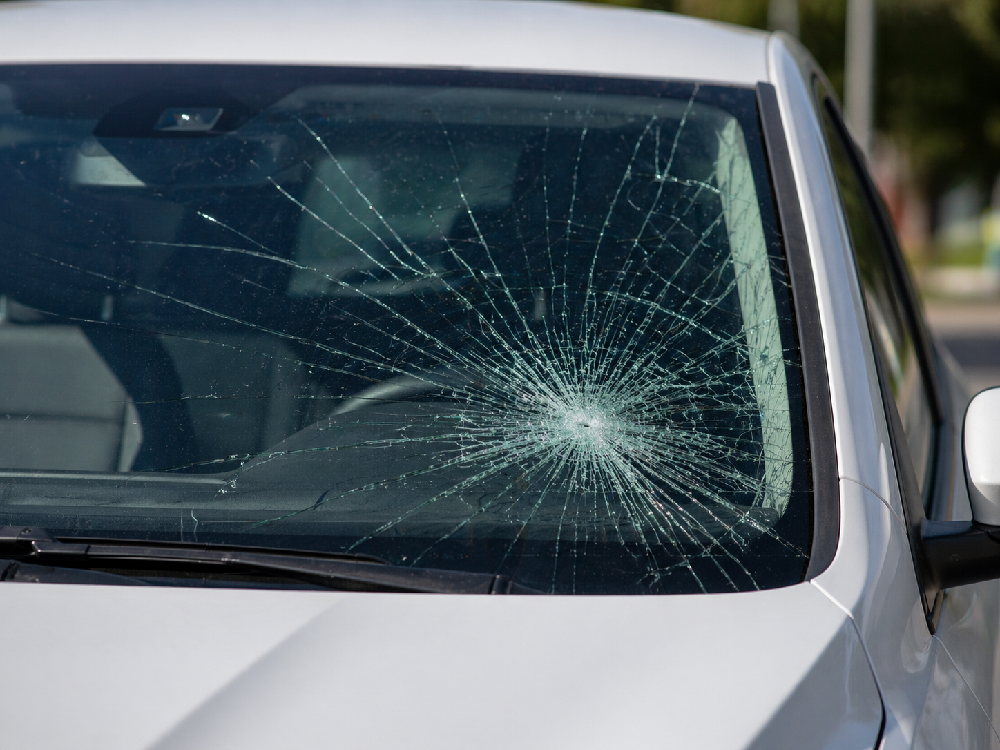
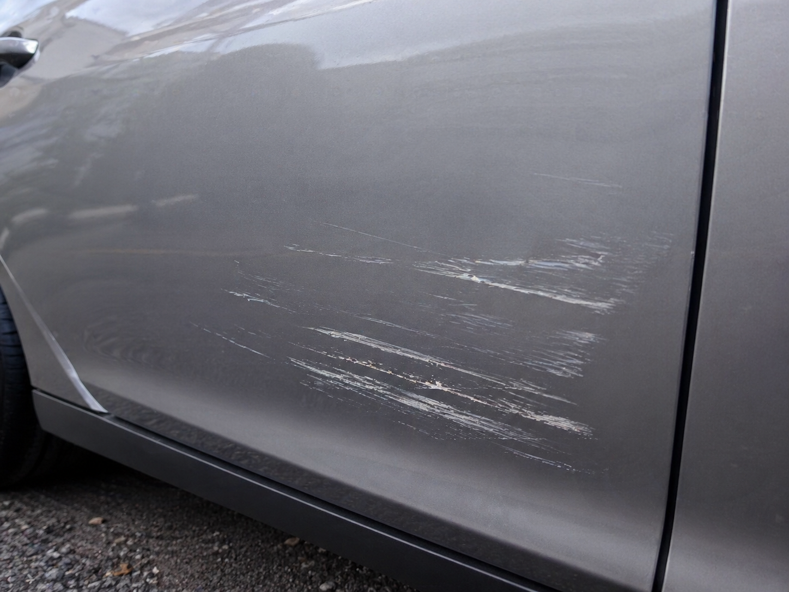

<!-- Navigation Header -->

  

    <a href="#" class="nav-logo">
      
CDC

      CAR DAMAGE CLASSIFIER
    </a>

    <nav class="nav-tabs">
      <a href="#overview" class="nav-tab active">Overview</a>
      <a href="car_damage.html" class="nav-tab">Demo</a>
      <a href="#results" class="nav-tab">Results</a>
      <a href="#methodology" class="nav-tab">Methodology</a>
      <a href="#quickstart" class="nav-tab">Docs</a>
      <a href="https://github.com/wrezachow/car-damage-classifier" class="nav-tab" target="_blank">Repository</a>
    </nav>

    <a href="https://github.com/wrezachow/car-damage-classifier" class="github-star-btn" target="_blank">
      ⭐ Star on GitHub
      197
    </a>
  

  <!-- Hero Section -->
  <section class="hero" id="overview">
    

      

        Computer Vision
        Deep Learning
        Auto Inspection
      

      <h1 class="hero-title">
        CAR DAMAGE
        CLASSIFIER
      </h1>

      

        End-to-end vehicle damage classification across 12 categories using FastAI + PyTorch.
      

      

        Trained on <strong>4,500+ labeled images</strong> across 12 damage types. Best model <strong>ResNet50</strong> achieves <strong>78.03% top-1 accuracy</strong> and is deployed on <a href="https://huggingface.co/spaces/wrezachow/car-damage-classifier" target="_blank">HuggingFace Spaces</a> with a modern web demo via GitHub Pages.
      

      

        <a href="car_damage.html" class="btn btn-primary">
          🚀 Live Demo
        </a>
        <a href="https://github.com/wrezachow/car-damage-classifier" class="btn btn-secondary" target="_blank">
          📁 GitHub Repo
        </a>
        <a href="https://huggingface.co/spaces/wrezachow/car-damage-classifier" class="btn btn-secondary" target="_blank">
          🤗 Model / Space
        </a>
      

    

    

      

        
        
DENT

      

      

        
        
CRACKED WINDSHIELD

      

      

        
        
SCRATCH

      

      

        
        
RUST / CORROSION

      

      

        
        
BUMPER DAMAGE

      

    

  </section>

  <!-- Metrics Grid -->
  

    

      
📊

      
4,500+

      
Labeled Images

    

    

      
🏷️

      
12

      
Categories

    

    

      
🧠

      
ResNet50

      
Best Model

    

    

      
🎯

      
78.03%

      
Top-1 Accuracy

    

    

      
⚡

      
FastAI

      
Framework

    

    

      
☁️

      
HF Spaces

      
Deployment

    

  

  <!-- Why This Project Matters -->
  <section class="section">
    

      <h2 class="section-title">Why This Project Matters</h2>
      
Practical applications for automotive safety and insurance

    

    

      <ul class="features">
        <li>Automates visual vehicle inspection for insurance claims, fleet management, and repair shops</li>
        <li>Reduces manual review time and provides consistent damage assessment</li>
        <li>Accelerates repair shop intake processing and vehicle condition documentation</li>
        <li>Enables faster, data-driven decision-making for insurance claim triage</li>
      </ul>
    

  </section>

  <!-- Results Section -->
  <section class="section" id="results">
    

      <h2 class="section-title">Results at a Glance</h2>
      
Model performance comparison and per-class accuracy

    

    <h3 style="margin-top: 40px; margin-bottom: 20px;">Model Accuracy Comparison</h3>
    

      
    

    

      <h3>Key Findings</h3>
      <ul>
        <li><strong>ResNet50</strong> achieved the best overall accuracy at <strong>78.03%</strong></li>
        <li><strong>ResNet34</strong> performed nearly as well at <strong>77.93%</strong></li>
        <li><strong>EfficientNet-B0</strong> underperformed at <strong>72.18%</strong> in this setup</li>
        <li>The small gap between ResNet34 and ResNet50 suggests the task is constrained more by class overlap and data ambiguity than raw model capacity</li>
      </ul>
    

    <h3 style="margin-top: 60px; margin-bottom: 20px;">Per-Class Accuracy (ResNet50)</h3>
    

      
    

    

      <h3>Performance Analysis</h3>
      
<strong>Strongest Classes (>90% accuracy):</strong>

      <ul>
        <li>Broken Side Mirror (98.9%)</li>
        <li>Flat Tire (95.5%)</li>
        <li>Rust/Corrosion (94.7%)</li>
      </ul>
      
<strong>Most Challenging Classes (<70% accuracy):</strong>

      <ul>
        <li>Car Scratch (58.6%) - subtle and thin, easily confused with vandalism</li>
        <li>Fire Damage (66.7%) - varies widely in severity and visual context</li>
      </ul>
    

    <h3 style="margin-top: 60px; margin-bottom: 20px;">Confusion Matrix</h3>
    

      
    

    

      <h3>Top Confusion Pairs</h3>
      
The most common classification errors occur between visually similar damage types:

      <ul class="confusion-pairs">
        <li>Car Scratch ↔ Vandalism/Keyed</li>
        <li>Car Dent ↔ Broken Bumper</li>
        <li>Hail Damage ↔ Car Dent</li>
        <li>Fire Damage ↔ Flood Damage</li>
        <li>No Damage ↔ Car Scratch / Car Dent</li>
      </ul>
    

  </section>

  <!-- Methodology & Pipeline -->
  <section class="section" id="methodology">
    

      <h2 class="section-title">Methodology & Pipeline</h2>
      
End-to-end training and deployment workflow

    

    

      

        
1

        <h4>Data Collection</h4>
        
4,500+ images from Bing & Google image search

      

      
→

      

        
2

        <h4>Preprocess & Augment</h4>
        
Resize, normalize, and apply FastAI augmentations

      

      
→

      

        
3

        <h4>Train</h4>
        
Fine-tune ResNet34, ResNet50, EfficientNet-B0

      

      
→

      

        
4

        <h4>Evaluate</h4>
        
Compare models, analyze confusion matrix

      

      
→

      

        
5

        <h4>Deploy</h4>
        
Export to Gradio on HuggingFace Spaces

      

    

  </section>

  <!-- Project Structure -->
  <section class="section">
    

      <h2 class="section-title">Project Structure</h2>
      
Repository organization

    

    <pre><code>car-damage-classifier/
├─ deployment/
│  ├─ app.py                 # Gradio app
│  └─ requirements.txt
├─ models/
│  └─ CarDamageClassifierV1.pkl
├─ notebooks/
│  ├─ data_preparation.ipynb
│  └─ TrainingAndCleaning.ipynb
├─ docs/
│  ├─ index.md
│  ├─ car_damage.html
│  └─ assets/
│     ├─ charts/
│     ├─ confusion-matrices/
│     └─ samples/
├─ scripts/
│  └─ generate_charts.py
└─ README.md</code></pre>
  </section>

  <!-- Deployment -->
  <section class="section">
    

      <h2 class="section-title">Deployment</h2>
      
Live demo and API endpoints

    

    

      

        <h3>HuggingFace Spaces</h3>
        
Interactive Gradio app for real-time predictions

        
<strong>Space:</strong> <code>wrezachow/car-damage-classifier</code>

        
<strong>Endpoint:</strong> <code>/predict</code>

        

          <a href="https://huggingface.co/spaces/wrezachow/car-damage-classifier" class="btn btn-secondary" target="_blank" style="margin: 0;">
            Visit Space →
          </a>
        

      

      

        <h3>GitHub Pages</h3>
        
Static web demo using <code>@gradio/client</code>

        
<strong>Landing:</strong> Project documentation

        
<strong>Demo:</strong> <a href="car_damage.html" style="color: var(--accent-blue);">Interactive interface</a>

        

          <a href="car_damage.html" class="btn btn-secondary" style="margin: 0;">
            Try Demo →
          </a>
        

      

    

  </section>

  <!-- Quick Start -->
  <section class="section" id="quickstart">
    

      <h2 class="section-title">Quick Start</h2>
      
Run the model locally

    

    

      <h3>1. Clone the repository</h3>
      <pre><code>git clone https://github.com/wrezachow/car-damage-classifier.git
cd car-damage-classifier</code></pre>

      <h3 style="margin-top: 32px;">2. Create virtual environment</h3>
      <pre><code>python -m venv .venv</code></pre>

      <h3 style="margin-top: 32px;">3. Activate environment</h3>
      
<strong>Windows PowerShell:</strong>

      <pre><code>.venv\Scripts\Activate.ps1</code></pre>
      
<strong>macOS/Linux:</strong>

      <pre><code>source .venv/bin/activate</code></pre>

      <h3 style="margin-top: 32px;">4. Install dependencies</h3>
      <pre><code>pip install -r deployment/requirements.txt</code></pre>

      <h3 style="margin-top: 32px;">5. Run the app</h3>
      <pre><code>python deployment/app.py</code></pre>
      
Open <code>http://127.0.0.1:7860</code> in your browser

    

  </section>

  <!-- Tech Stack -->
  <section class="section">
    

      <h2 class="section-title">Tech Stack</h2>
      
Technologies and frameworks used

    

    

      

        <h3>Training & Model</h3>
        <ul>
          <li>Python 3.x</li>
          <li>FastAI</li>
          <li>PyTorch</li>
          <li>Jupyter Notebooks</li>
        </ul>
      

      

        <h3>Deployment</h3>
        <ul>
          <li>Gradio</li>
          <li>HuggingFace Spaces</li>
          <li>GitHub Pages</li>
          <li>@gradio/client</li>
        </ul>
      

    

  </section>

<!-- Footer -->
<footer>
  

    

      

        
CDC

        
CAR DAMAGE CLASSIFIER

      

      

        Built with ❤️ by wrezachow • FastAI + PyTorch • Computer Vision for Automotive Safety
      

      

        <a href="https://github.com/wrezachow" class="social-link" target="_blank" title="GitHub">
          <svg width="20" height="20" fill="currentColor" viewBox="0 0 24 24"><path d="M12 0C5.37 0 0 5.37 0 12c0 5.31 3.435 9.795 8.205 11.385.6.105.825-.255.825-.57 0-.285-.015-1.23-.015-2.235-3.015.555-3.795-.735-4.035-1.41-.135-.345-.72-1.41-1.23-1.695-.42-.225-1.02-.78-.015-.795.945-.015 1.62.87 1.845 1.23 1.08 1.815 2.805 1.305 3.495.99.105-.78.42-1.305.765-1.605-2.67-.3-5.46-1.335-5.46-5.925 0-1.305.465-2.385 1.23-3.225-.12-.3-.54-1.53.12-3.18 0 0 1.005-.315 3.3 1.23.96-.27 1.98-.405 3-.405s2.04.135 3 .405c2.295-1.56 3.3-1.23 3.3-1.23.66 1.65.24 2.88.12 3.18.765.84 1.23 1.905 1.23 3.225 0 4.605-2.805 5.625-5.475 5.925.435.375.81 1.095.81 2.22 0 1.605-.015 2.895-.015 3.3 0 .315.225.69.825.57A12.02 12.02 0 0024 12c0-6.63-5.37-12-12-12z"/></svg>
        </a>
        <a href="https://linkedin.com/in/wrezachow" class="social-link" target="_blank" title="LinkedIn">
          <svg width="20" height="20" fill="currentColor" viewBox="0 0 24 24"><path d="M20.447 20.452h-3.554v-5.569c0-1.328-.027-3.037-1.852-3.037-1.853 0-2.136 1.445-2.136 2.939v5.667H9.351V9h3.414v1.561h.046c.477-.9 1.637-1.85 3.37-1.85 3.601 0 4.267 2.37 4.267 5.455v6.286zM5.337 7.433c-1.144 0-2.063-.926-2.063-2.065 0-1.138.92-2.063 2.063-2.063 1.14 0 2.064.925 2.064 2.063 0 1.139-.925 2.065-2.064 2.065zm1.782 13.019H3.555V9h3.564v11.452zM22.225 0H1.771C.792 0 0 .774 0 1.729v20.542C0 23.227.792 24 1.771 24h20.451C23.2 24 24 23.227 24 22.271V1.729C24 .774 23.2 0 22.222 0h.003z"/></svg>
        </a>
        <a href="mailto:contact@wrezachow.com" class="social-link" title="Email">
          <svg width="20" height="20" fill="none" stroke="currentColor" stroke-width="2" stroke-linecap="round" stroke-linejoin="round" viewBox="0 0 24 24"><path d="M4 4h16c1.1 0 2 .9 2 2v12c0 1.1-.9 2-2 2H4c-1.1 0-2-.9-2-2V6c0-1.1.9-2 2-2z"></path><polyline points="22,6 12,13 2,6"></polyline></svg>
        </a>
      

    

    

      <h4>Quick Links</h4>
      <ul class="footer-links">
        <li><a href="#overview">Overview</a></li>
        <li><a href="car_damage.html">Demo</a></li>
        <li><a href="#results">Results</a></li>
        <li><a href="#methodology">Methodology</a></li>
      </ul>
    

    

      <h4>Resources</h4>
      <ul class="footer-links">
        <li><a href="https://github.com/wrezachow/car-damage-classifier" target="_blank">GitHub Repository</a></li>
        <li><a href="https://huggingface.co/spaces/wrezachow/car-damage-classifier" target="_blank">HuggingFace Space</a></li>
        <li><a href="#quickstart">Documentation</a></li>
        <li><a href="assets/SOURCES.md">Asset Sources</a></li>
      </ul>
    

  

  

    © 2025 wrezachow. All rights reserved. | MIT License
  

</footer>
